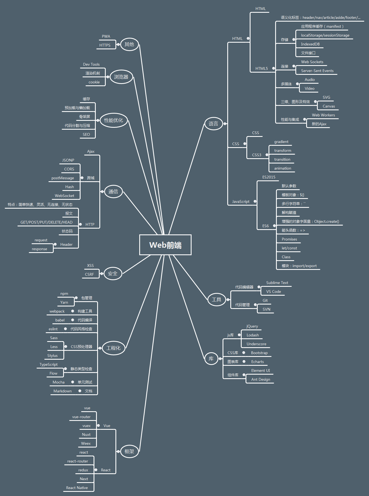
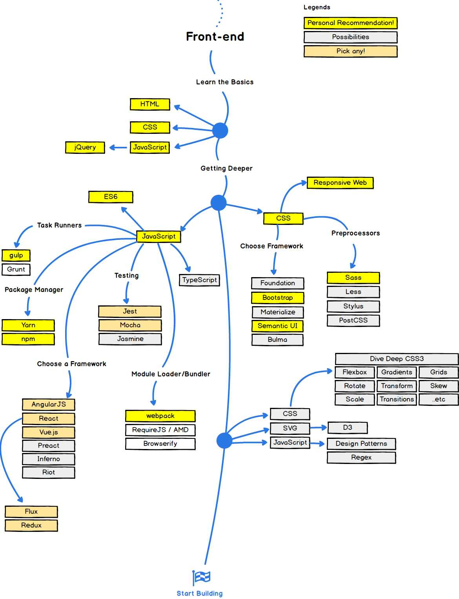

# 我的web前端学习图谱

这第一幅图是对我学习的web前端知识的总结和梳理，由于认识的局限性，可能分类的不够合理，随着学习的深入和认识的提升，我会不定期修改和完善的。

下面这幅图是引用网上大神的一个前端从入门到进阶的路线图，对我的学习也起到了非常重要的指引作用，分享给大家。

接下来是一些杂谈，主要回忆一下自己的前端学习过程，总结了一些学习资源和书籍推荐。

## 工作回顾
从2016年7月工作至今，已经1年多时间了。工作之前也没有系统学习过前端知识，之前一直用的java。工作中第一个接手的项目的是一个后台管理系统，整个系统基于ASP.NET MVC框架开发，前端用到的技术主要是B-JUI+jQuery+Echarts，后端开始用的C#，后来也转restful(Spring MVC + Mybatis)。

## 前端学习路线

### 第一阶段
开始接手的第一门语言就是HTML,主要是通过[W3school](http://www.w3school.com.cn/)和[菜鸟教程](http://www.runoob.com/)，这两个网站还真是非常适合零基础的。然后就是学习CSS和JS的基础用法，大部分操作都是通过jQuery操作DOM完成，所以更多精力放在熟悉jQuery的API上。后来慢慢意识到JS的重要性，买了一本《JavaScript编程全解》从头到尾系统的学习了JS。后来陆续买了一些书，系统学习前端基础知识，主要看过的书如下。
###### HTML书单
- 《Head First HTML与CSS》
###### CSS书单
- 《CSS揭秘》（不适合初学者）
###### JavaScript书单
- 《JavaScript编程全解》
- 《JavaScript语言精粹》
- 《JavaScript高级程序设计》
- 《JavaScript权威指南》
- 《你不知道的JavaScript》
经过阅读书籍和博客、网站等，算是基本掌握了前端语言基础，这时还没有学习ES6和CSS3知识。

### 第二阶段
由于都是自己摸索，感觉起步阶段比较慢，入门后进步比较快。这一阶段主要是学习HTML5/CSS3/ES6的知识，我的重点主要放在ES6上，CSS方面比较薄弱一些。ES6电子书推荐：[《ECMAScript 6 入门》](http://es6.ruanyifeng.com/)。当然了，[廖雪峰的博客](https://www.liaoxuefeng.com/)也是非常推荐的。这阶段也学习了一些浏览器、cookie/session、Ajax等相关内容。

### 第三阶段
这一阶段主要是学习框架和前端工程化相关内容。说到框架不得不提React/Vue/Angular了，我当时第一个学的框架是React，为什么选React呢？第一，大厂维护，稳定可靠；第二，生态丰富，资源多；现在回头看看，可能Vue对初学者更友好些，平滑的学习曲线，详细到感人的官方文档。推荐一个学习React非常棒的资源：[《React.js 小书》](http://huziketang.com/books/react/)。后来跟着视频教程，用react+react-router+redux做了一个仿大众点评的WebApp。第二个学习的框架就是Vue了，再一次表扬一下Vue的官方文档，我从头到尾至少读了3遍。每当我对Vue理解有困惑时，我就会去读一遍文档。，学习的过程中，用vue+element UI做了一个后台管理系统的框架，后续会把代码分享出来。实际做项目的过程中，自然会需要你去掌握npm/webpack/eslint等等这些工具了。这一阶段的学习，我觉得最重要的就是实践，不动手实际做点东西，真的很难学会这些框架和工具，更别提积累一些踩坑的经验了。

### 第四阶段
这一阶段更多关心的是效率、性能和稳定性方面的东西。怎么用工具打造一套高效的自动化工作流？怎么提高网站的首屏响应速度？怎么监控网站的代码异常和业务异常？怎么保证网站在多端显示的一致性和兼容性？还有一些新知识的学习等等。

## 总结
从刚接触前端，到对前端产生浓厚的兴趣，然后开始系统学习前端基础知识，逐渐深入学习更多的内容。我都是自己一个人自学，我总结了我自学前端的一些经验，希望对初学者有帮助。
- 打好基础，尤其是JavaScript；不要一上来就各种库和框架，不用着急，把基础打好，后面的内容学起来会很快的；
- 多读一些库或框架的源码，对提高自己代码质量有非常大的帮助；
- 学会查找所需的学习资源，各大博客网站、GitHub、书籍、知乎live、慕课网等，有非常多的资源可以利用；
- 多和比自己水平高的人交流，封闭学习非常不利于自我的定位和提升；

一年多的时间，感觉自己对前端才刚刚入门，还有非常多的内容需要学习。更重要的是，对学习过的内容是否真正理解和掌握，还需要不断实践和深入！
